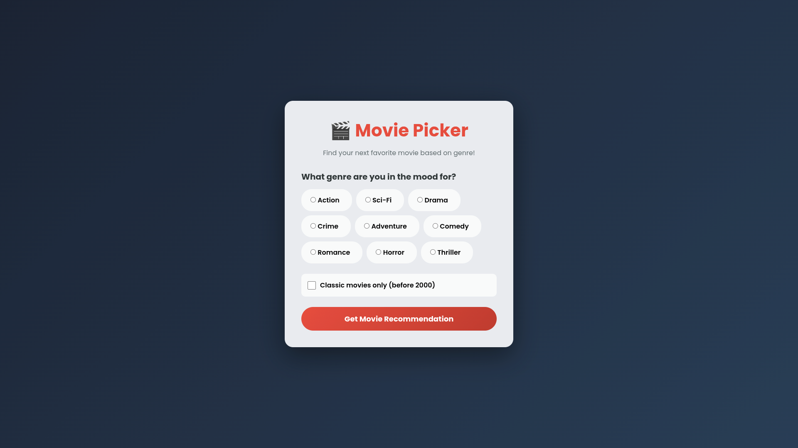

# 🎬 Movie Picker




<br>


A dynamic movie recommendation web app that helps users find their next favorite film based on genre preferences. Built with vanilla JavaScript and featuring a sleek, modern UI with modal popups.

## 🌟 Features

- 🎭 **Genre-Based Filtering** - Choose from Action, Sci-Fi, Drama, Comedy, Horror, and more
- 🎞️ **Classic Movie Filter** - Toggle to show only movies released before 2000
- 🎲 **Random Selection** - Get a random movie from matching results
- 🖼️ **Beautiful Movie Cards** - Display movie posters, descriptions, and IMDb ratings
- ✨ **Smooth Animations** - Hover effects and transitions for enhanced UX
- 📱 **Responsive Design** - Works seamlessly on all device sizes
- 🎯 **Click-Outside to Close** - Enhanced modal interaction

## 🚀 Live Demo

**[View Live Demo](https://exc1d.github.io/movie-picker/)**

## 📸 Screenshots

### Main Interface

The genre selection interface with dynamic radio buttons and classic movie filter.

### Movie Card Modal

Beautiful movie card displaying poster, title, year, description, and IMDb rating.

## 🛠️ Technologies Used

- **HTML5** - Semantic markup structure
- **CSS3** - Custom styling, gradients, flexbox, animations
- **Vanilla JavaScript (ES6+)** - Modules, arrow functions, array methods
- **Google Fonts** - Poppins font family

## 📂 Project Structure

```
movie-picker/
│
├── index.html          # Main HTML structure
├── styles.css          # All styling and animations
├── script.js           # JavaScript functionality
├── data.js             # Movie data with ES6 export
└── README.md           # Project documentation
```

## 💻 Key JavaScript Concepts

### Array Filtering & Iteration

```javascript
function getMatchingMoviesArray() {
  return moviesData.filter((movie) => {
    if (isClassicsOnly) {
      return movie.genreTags.includes(selectedGenre) && movie.isClassic;
    }
    return movie.genreTags.includes(selectedGenre);
  });
}
```

### Random Selection Algorithm

```javascript
function getSingleMovieObject() {
  const movieMatches = getMatchingMoviesArray();
  if (movieMatches.length === 1) return movieMatches[0];
  return movieMatches[Math.floor(Math.random() * movieMatches.length)];
}
```

### Dynamic Radio Button Generation

```javascript
function renderGenreRadios(movies) {
  const genres = getGenresArray(movies);
  let radioBtns = "";
  for (const genre of genres) {
    radioBtns += `
      <div class="radio">
        <input type="radio" id="${genre}" value="${genre}" name="genres"/>
        <label for="${genre}">${
      genre.charAt(0).toUpperCase() + genre.slice(1)
    }</label>
      </div>
    `;
  }
  genreRadios.innerHTML = radioBtns;
}
```

### Extracting Unique Genres

```javascript
function getGenresArray(movies) {
  const genres = [];
  for (const movie of movies) {
    for (const genre of movie.genreTags) {
      if (!genres.includes(genre)) {
        genres.push(genre);
      }
    }
  }
  return genres;
}
```

## 🎨 CSS Highlights

### Gradient Background

```css
body {
  background: linear-gradient(135deg, #141e30 0%, #243b55 100%);
}
```

### Interactive Radio Buttons

```css
.radio:hover {
  background: #ff19007c;
  transform: translateY(-2px);
  border-color: #c0392b;
}
```

### Modal Overlay

```css
#movie-modal {
  background: rgba(0, 0, 0, 0.9);
  display: flex;
  justify-content: center;
  align-items: center;
}
```

## 🎯 Features Implemented

✅ Dynamic genre extraction from movie data  
✅ Radio button generation from unique genres  
✅ Highlight effect on selected genre  
✅ Classic movies filter (pre-2000)  
✅ Random movie selection from matches  
✅ Modal popup with movie details  
✅ Close modal with X button  
✅ Close modal by clicking outside (overlay click)  
✅ Error handling for no results  
✅ Capitalized genre labels  
✅ Real movie poster images from IMDb  
✅ IMDb ratings display  
✅ Responsive design

## 🚦 How to Use

1. **Clone the repository**

   ```bash
   git clone https://github.com/Exc1D/movie-picker.git
   cd movie-picker
   ```

2. **Open in browser**

   - Simply open `index.html` in your web browser
   - Or use a local development server like Live Server (VS Code extension)

3. **Select a genre**

   - Click on any genre radio button
   - Optionally check "Classic movies only" for pre-2000 films

4. **Get recommendation**
   - Click "Get Movie Recommendation"
   - View the movie card in the modal popup
   - Click X or outside the modal to close

## 📚 Learning Outcomes

This project demonstrates proficiency in:

- **ES6 Modules** - Import/export functionality
- **Array Methods** - `.filter()`, `.includes()`, `.push()`
- **DOM Manipulation** - Creating and updating elements dynamically
- **Event Handling** - Click, change, and overlay click events
- **Data Structures** - Working with arrays of objects and nested arrays
- **Conditional Logic** - Multiple filter conditions
- **Random Selection** - Using `Math.random()` and `Math.floor()`
- **Form Controls** - Radio buttons and checkboxes
- **Modal Patterns** - Popup windows with overlay
- **CSS Animations** - Transitions and transforms
- **User Experience** - Error handling and helpful alerts

## 🎬 Movie Data Structure

Each movie object contains:

```javascript
{
  genreTags: ["action", "sci-fi"],    // Array of genre strings
  isClassic: true,                     // Boolean for pre-2000 filter
  title: "The Matrix",                 // Movie title
  year: 1999,                          // Release year
  poster: "url",                       // Movie poster URL
  description: "Short description",    // Movie synopsis
  rating: "IMDb 8.7/10"               // IMDb rating
}
```

## 🔮 Future Enhancements

- [ ] Add more movies to the database
- [ ] Implement sorting by rating or year
- [ ] Add movie trailers with embedded YouTube player
- [ ] Include streaming platform availability
- [ ] Add "Add to Watchlist" functionality with localStorage
- [ ] Implement search functionality
- [ ] Add director and cast information
- [ ] Create a favorites system
- [ ] Add social sharing buttons
- [ ] Implement keyboard navigation (ESC to close modal)

## 🤝 Contributing

Contributions are welcome! Feel free to:

- Add more movies to `data.js`
- Improve the UI/UX
- Add new features
- Fix bugs
- Improve documentation

## 📄 License

This project is open source and available under the [MIT License](LICENSE).

## 🙏 Acknowledgments

- Inspired by Scrimba's "Pumpkin's Purrfect Meme Picker" module
- Movie data sourced from IMDb
- Poster images from IMDb and Amazon Media
- Built as a practice exercise for JavaScript array methods and DOM manipulation

## 📧 Contact

**GitHub:** [@Exc1D](https://github.com/Exc1D)  
**Project Link:** [https://github.com/Exc1D/movie-picker](https://github.com/Exc1D/movie-picker)  
**Live Demo:** [https://exc1d.github.io/movie-picker/](https://exc1d.github.io/movie-picker/)

---

⭐ If you found this project helpful, please consider giving it a star!

**Happy movie watching!** 🍿

**_For Joy, Hero, Aiah, and Aria 🦴💙_**
